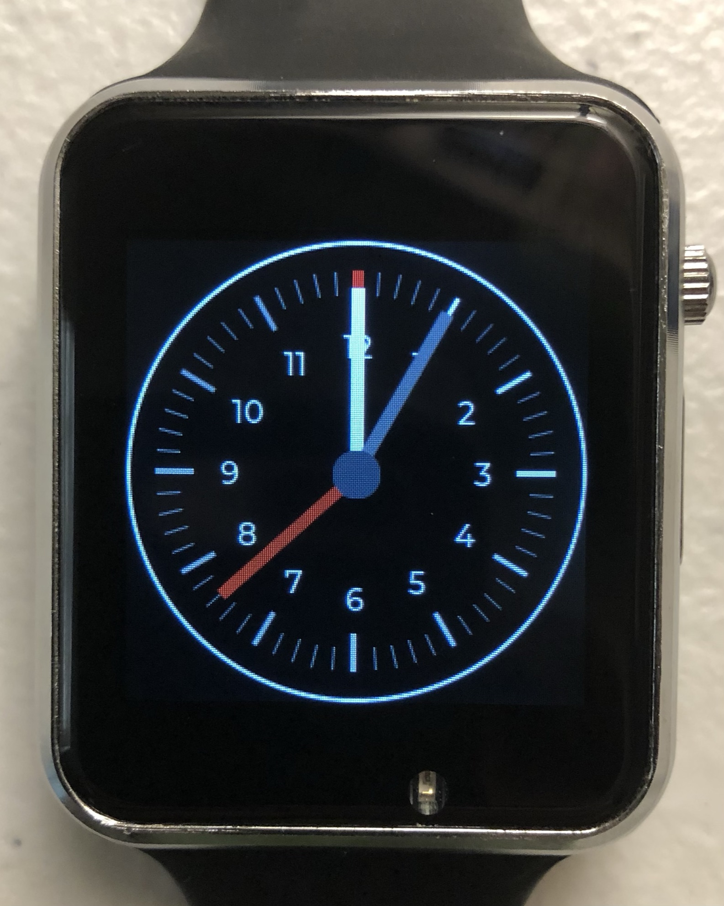
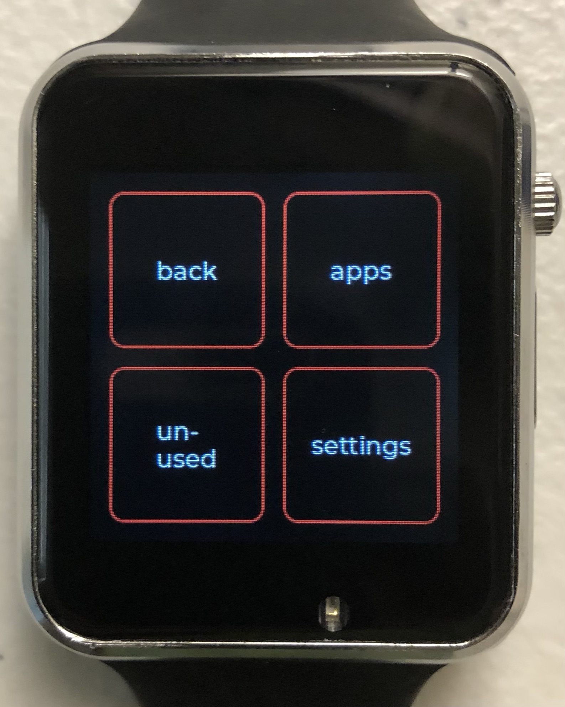
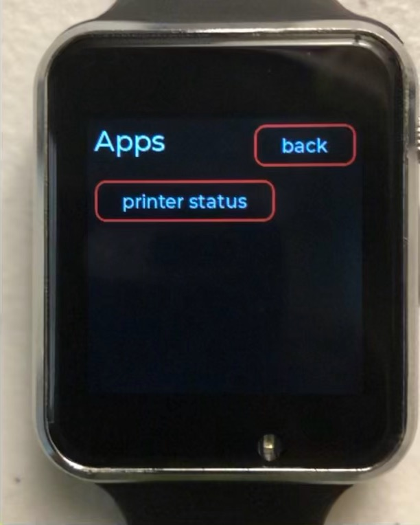
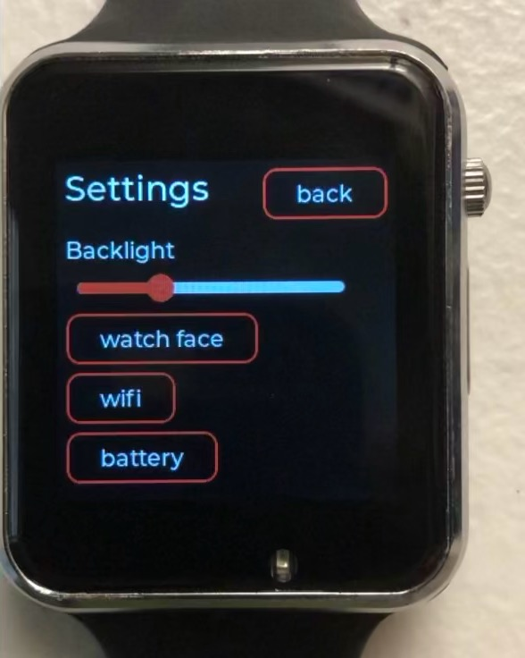
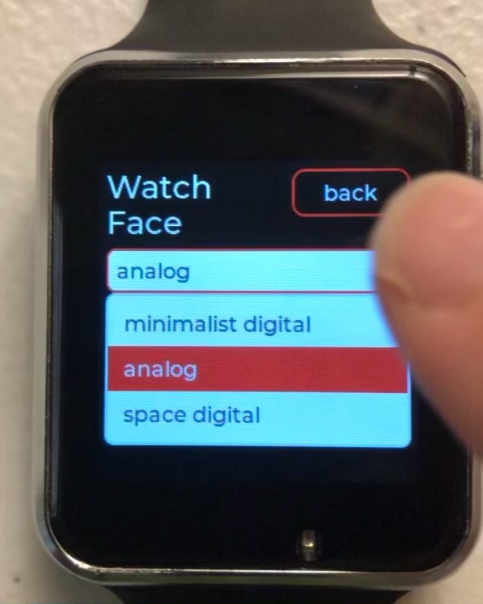
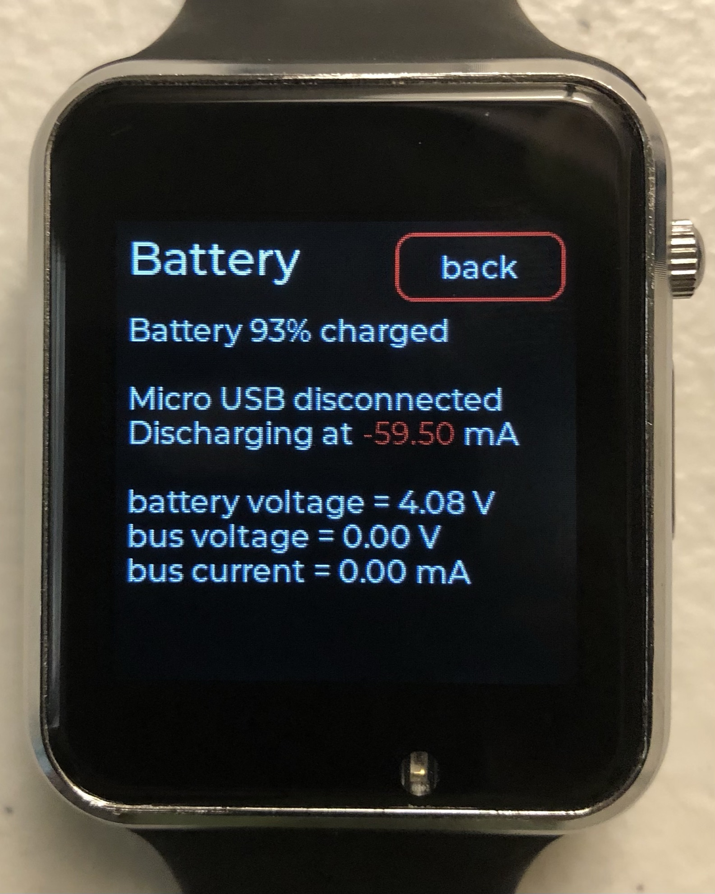
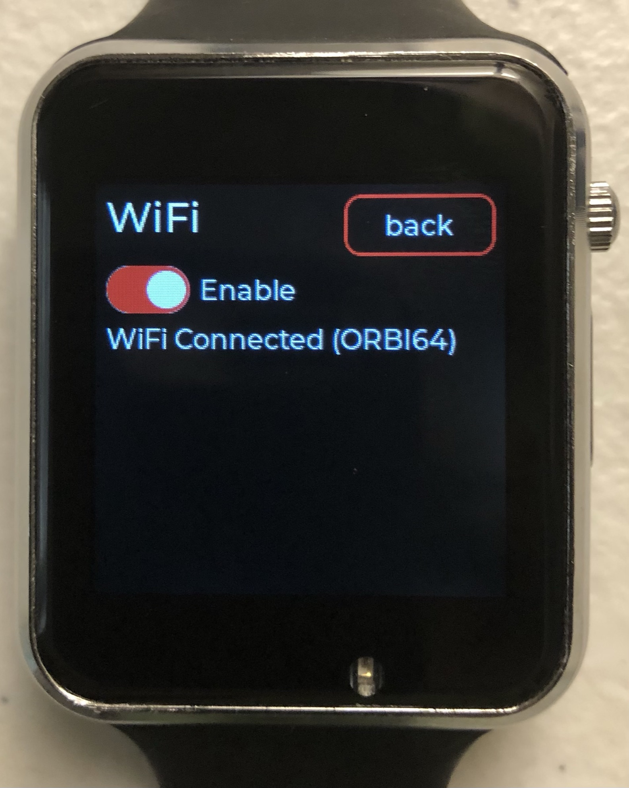
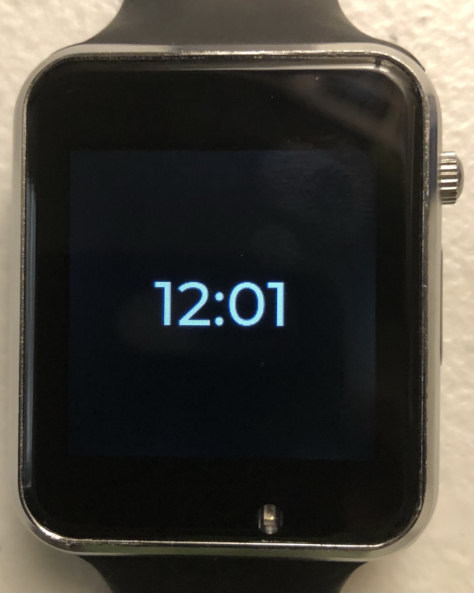
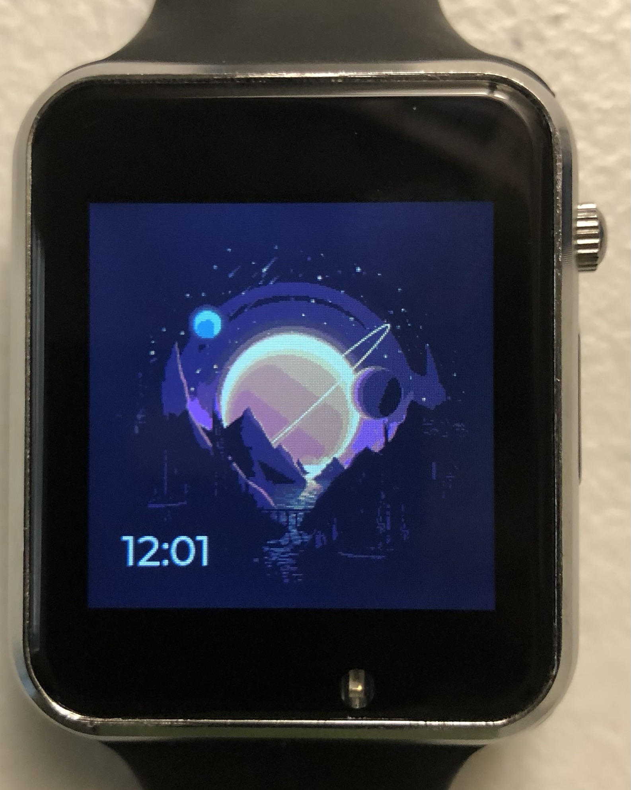

# jwatch
 A robust smatwatch application built for the TTGO T-Watch 2020 v1 using the Arduino framework. Currently a work in progress.

## Features
 * A slick UI, thanks to the LVGL framework
 * Lots of extendability
 * Clock functionality with multiple faces
 * Apple notifications over BLE (broken right now)
 * Battery readouts
 * Robust screen system
 * Settings page
 * Wake from raise and button press
 * WiFi connectivity
 * Some others I'm forgetting

## Screenshots
 
 
 
 
 
 
 
 
 
 